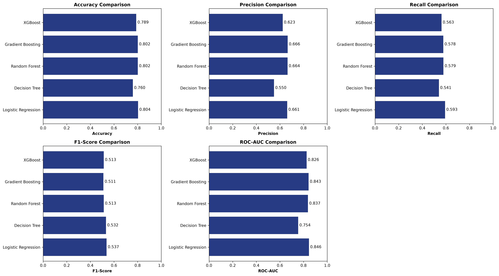
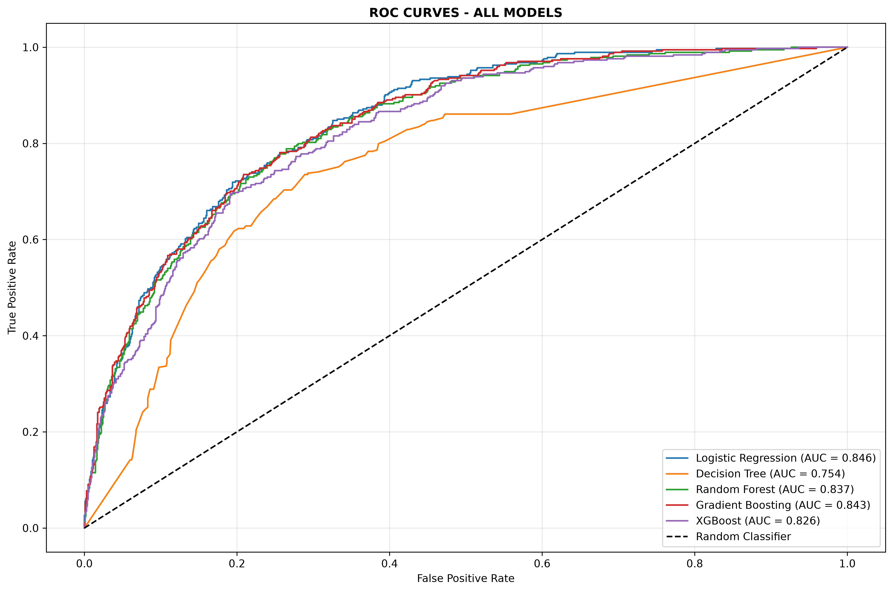
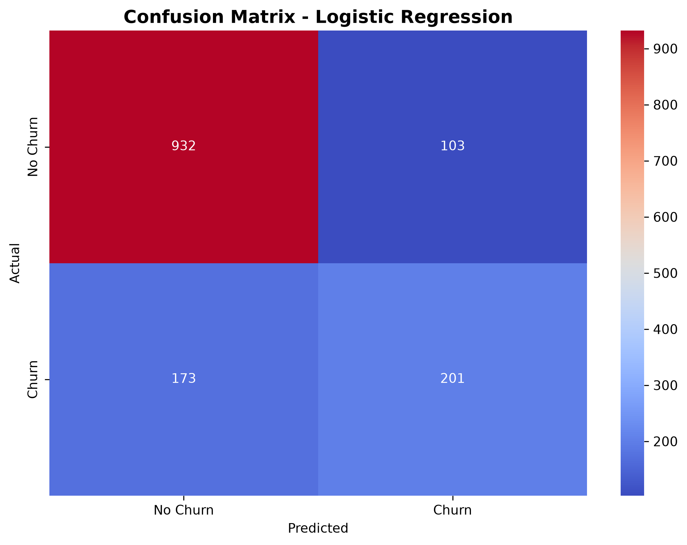

# 📊 Customer Churn Prediction — End-to-End ML Pipeline

<p align="center">


</p>

<p align="center">
  <b>An end-to-end Machine Learning pipeline for predicting customer churn in the telecommunications industry.</b>
</p>

<p align="center">
  <a href="#-overview">Overview</a> •
  <a href="#-business-problem">Business Problem</a> •
  <a href="#-dataset">Dataset</a> •
  <a href="#-methodology">Methodology</a> •
  <a href="#-results">Results</a> •
  <a href="#-installation">Installation</a>
</p>

---

## 📋 Overview

Customer churn is one of the most important challenges faced by subscription-based businesses.

This project implements a complete **Machine Learning pipeline** to predict whether a telecommunications customer is likely to **churn** or **remain with the company**.

The project covers the complete ML lifecycle:

```text
Data Collection
      ↓
Data Cleaning
      ↓
Exploratory Data Analysis
      ↓
Feature Engineering
      ↓
Data Preprocessing
      ↓
Model Training
      ↓
Model Evaluation
      ↓
Model Selection
      ↓
Model Persistence
      ↓
Future Deployment
```

The primary goal is to build a reliable predictive model while also extracting meaningful **business insights** that can help companies improve customer retention.

---

## 💼 Business Problem

Customer acquisition is often more expensive than retaining an existing customer.

When customers leave, businesses can lose:

* Revenue
* Customer Lifetime Value
* Marketing investment
* Future business opportunities

A churn prediction system can identify customers who are likely to leave **before they actually churn**, allowing the company to take proactive retention actions.

### 🎯 Business Objective

The objective of this project is to:

* Predict customer churn.
* Identify high-risk customers.
* Understand the major factors influencing churn.
* Support data-driven retention strategies.
* Reduce potential revenue loss.

---

## 🎯 Project Objectives

This project focuses on the following objectives:

1. Analyze customer behavior and churn patterns.
2. Clean and preprocess raw customer data.
3. Perform Exploratory Data Analysis.
4. Create meaningful engineered features.
5. Train multiple classification algorithms.
6. Compare models using multiple evaluation metrics.
7. Select the best-performing model.
8. Save the trained model for future predictions.
9. Generate actionable business insights.

---

## 📊 Key Results

| Metric             |                    Result |
| ------------------ | ------------------------: |
| 👥 Total Customers |                 **7,043** |
| 🎯 Problem Type    | **Binary Classification** |
| 🏆 Best Model      |   **Logistic Regression** |
| 📈 ROC-AUC         |                **0.8458** |
| 🎯 Accuracy        |                **80.41%** |
| 📊 F1-Score        |                **0.5929** |
| 🔴 Churn Rate      |                **~26.5%** |

---

# 📊 Dataset

The project uses the **Telco Customer Churn Dataset**, which contains customer demographic information, subscribed services, account details, contract information, and billing information.

### Dataset Information

* **Dataset:** Telco Customer Churn
* **Records:** 7,043 customers
* **Target Variable:** `Churn`
* **Target Classes:** `Yes / No`
* **Churn Rate:** Approximately 26.5%

### 📌 Data Categories

#### 👤 Demographics

* Gender
* Senior Citizen
* Partner
* Dependents

#### 📄 Account Information

* Tenure
* Contract
* Payment Method
* Paperless Billing

#### 📡 Services

* Phone Service
* Multiple Lines
* Internet Service
* Online Security
* Online Backup
* Device Protection
* Tech Support
* Streaming TV
* Streaming Movies

#### 💰 Charges

* Monthly Charges
* Total Charges

---

# 🔍 Methodology

## 1️⃣ Data Preprocessing

The raw dataset was cleaned and transformed before being provided to the machine learning models.

### Preprocessing Steps

* Checked dataset structure.
* Identified missing values.
* Handled missing values in `TotalCharges`.
* Converted numerical columns to appropriate data types.
* Checked for duplicate records.
* Removed unnecessary identifiers.
* Encoded categorical variables.
* Scaled numerical features.
* Prepared training and testing datasets.

---

## 2️⃣ Feature Engineering

Additional features were created to improve the model's understanding of customer behavior.

### `tenure_group`

Customers were categorized based on their tenure:

```text
0–12 Months
13–24 Months
25–48 Months
49+ Months
```

### `avg_monthly_per_tenure`

A derived spending metric was created to capture customer spending behavior relative to their tenure.

### `num_services`

The number of services subscribed by each customer was calculated to represent customer engagement.

---

## 3️⃣ Model Training

Five machine learning algorithms were trained and compared:

| Model               | Description                                     |
| ------------------- | ----------------------------------------------- |
| Logistic Regression | Baseline and interpretable classification model |
| Decision Tree       | Rule-based classification algorithm             |
| Random Forest       | Ensemble of multiple decision trees             |
| Gradient Boosting   | Sequential ensemble learning algorithm          |
| XGBoost             | Optimized gradient boosting algorithm           |

---

## 4️⃣ Model Evaluation

The following metrics were used to evaluate model performance:

### Accuracy

Measures the percentage of total predictions that were correct.

### Precision

Measures how many customers predicted as churners actually churned.

### Recall

Measures how many actual churners were correctly identified.

### F1-Score

Balances precision and recall.

### ROC-AUC ⭐

Measures the model's ability to distinguish between churn and non-churn customers.

ROC-AUC was considered the **primary metric for model comparison**.

---

# 🏆 Results

After training and comparing multiple machine learning algorithms, **Logistic Regression** achieved the best ROC-AUC performance.

### Final Model Performance

| Metric      |      Score |
| ----------- | ---------: |
| 🏆 ROC-AUC  | **0.8458** |
| 🎯 Accuracy | **80.41%** |
| 📊 F1-Score | **0.5929** |

### Selected Model

```text
                 Model Selection
                       ↓
              Logistic Regression
                       ↓
                ROC-AUC = 0.8458
                       ↓
              Final Selected Model
```

The model was selected based on its overall predictive performance and suitability for the churn prediction problem.

---

# 🔍 Key Business Insights

The analysis identified several important patterns related to customer churn.

## 1️⃣ Contract Type

Customers with **month-to-month contracts** show significantly higher churn tendencies compared with customers who have longer-term contracts.

### Business Recommendation

Encourage customers to adopt longer-term contracts through:

* Loyalty benefits
* Discounts
* Customized plans
* Long-term service packages

---

## 2️⃣ Customer Tenure

Customers with shorter tenure are more likely to churn.

This indicates that the early customer lifecycle is an important period for retention strategies.

### Business Recommendation

Businesses should focus retention campaigns on newly acquired customers.

---

## 3️⃣ Monthly Charges

Customers with higher monthly charges show increased churn tendencies.

### Business Recommendation

Companies can provide personalized pricing, service bundles, and targeted offers to high-value customers.

---

## 4️⃣ Technical Support

Customers subscribed to technical support show lower churn tendencies.

### Business Recommendation

Promoting technical support and customer assistance services may help improve customer satisfaction and retention.

---

# 📊 Visualizations

The project contains visualizations for understanding customer behavior and evaluating model performance.

### Model Comparison



---

### ROC Curves



---

### Confusion Matrix



---

# 🛠️ Technology Stack

### Programming Language

* Python 3.8+

### Data Processing

* Pandas
* NumPy

### Machine Learning

* Scikit-learn
* XGBoost
* Imbalanced-learn

### Visualization

* Matplotlib
* Seaborn

### Model Persistence

* Joblib

### Development Tools

* Jupyter Notebook
* VS Code
* Git
* GitHub

---

# 📁 Project Structure

```text
churn_prediction_pipeline/
│
├── 📂 data/
│   └── WA_Fn-UseC_-Telco-Customer-Churn.csv
│
├── 📂 notebooks/
│   ├── 01_eda.ipynb
│   ├── 02_data_preprocessing.ipynb
│   └── 03_model_training.ipynb
│
├── 📂 src/
│   ├── data_preprocessing.py
│   ├── feature_engineering.py
│   ├── train_model.py
│   └── predict.py
│
├── 📂 models/
│   ├── model.pkl
│   └── preprocessor.pkl
│
├── 📂 reports/
│   ├── model_comparison_graph.png
│   ├── roc_curves.png
│   └── confusion_matrix.png
│
├── 📄 requirements.txt
├── 📄 README.md
└── 📄 LICENSE
```

> **Note:** Update the project structure above if your actual repository contains different files or folders.

---

# 🚀 Getting Started

## 📌 Prerequisites

Make sure the following are installed:

```text
Python >= 3.8
pip
Git
Jupyter Notebook
```

---

# ⚙️ Installation

## 1️⃣ Clone the Repository

```bash
git clone https://github.com/riteshpanchal0906/churn_prediction_pipeline.git
```

Move into the project directory:

```bash
cd churn_prediction_pipeline
```

---

## 2️⃣ Create a Virtual Environment

### Windows

```bash
python -m venv venv
```

Activate the environment:

```bash
venv\Scripts\activate
```

### macOS / Linux

```bash
python3 -m venv venv
```

Activate:

```bash
source venv/bin/activate
```

---

## 3️⃣ Install Dependencies

```bash
pip install -r requirements.txt
```

---

# 📥 Dataset Setup

Download the Telco Customer Churn dataset and place the CSV file inside the `data/` directory.

Expected structure:

```text
data/
└── WA_Fn-UseC_-Telco-Customer-Churn.csv
```

---

# ▶️ Usage

## 🔬 1. Run Exploratory Data Analysis

Launch Jupyter Notebook:

```bash
jupyter notebook
```

Open:

```text
notebooks/01_eda.ipynb
```

Run the notebook to explore:

* Customer demographics
* Churn distribution
* Contract patterns
* Monthly charges
* Tenure
* Services
* Correlations

---

## 🧹 2. Run Data Preprocessing

```bash
python src/data_preprocessing.py
```

This prepares the dataset for model training.

---

## 🤖 3. Train Machine Learning Models

Open:

```text
notebooks/03_model_training.ipynb
```

Run the notebook to:

* Train multiple models
* Evaluate model performance
* Compare metrics
* Select the best model
* Save model artifacts

---

## 🔮 4. Generate Predictions

After training the model:

```bash
python src/predict.py
```

---

# 💾 Model Persistence

The trained model and preprocessing pipeline can be stored using **Joblib**.

### Save Model

```python
import joblib

joblib.dump(
    model,
    "models/model.pkl"
)

joblib.dump(
    preprocessor,
    "models/preprocessor.pkl"
)
```

### Load Model

```python
import joblib

model = joblib.load(
    "models/model.pkl"
)

preprocessor = joblib.load(
    "models/preprocessor.pkl"
)
```

This allows predictions to be generated without retraining the model.

---

# 🚀 Production Architecture

The current project can be extended into a production-ready ML application.

```text
                  ┌───────────────────┐
                  │   Customer Data   │
                  └─────────┬─────────┘
                            │
                            ▼
                  ┌───────────────────┐
                  │     FastAPI       │
                  │       API         │
                  └─────────┬─────────┘
                            │
                            ▼
                  ┌───────────────────┐
                  │  Preprocessing    │
                  │    Pipeline       │
                  └─────────┬─────────┘
                            │
                            ▼
                  ┌───────────────────┐
                  │   ML Prediction   │
                  │      Model        │
                  └─────────┬─────────┘
                            │
                            ▼
                  ┌───────────────────┐
                  │ Churn Probability │
                  └─────────┬─────────┘
                            │
                            ▼
                  ┌───────────────────┐
                  │ Retention Action  │
                  └───────────────────┘
```

---

# 💼 Business Impact

A customer churn prediction system can help businesses move from:

```text
Reactive Customer Management
          ↓
Customer Leaves
          ↓
Revenue Loss
```

to:

```text
Predict Customer Churn
          ↓
Identify High-Risk Customers
          ↓
Targeted Retention Campaign
          ↓
Improved Customer Retention
```

### Potential Benefits

* 📉 Reduce customer churn
* 💰 Improve revenue retention
* 📈 Increase Customer Lifetime Value
* 🎯 Improve marketing efficiency
* 🤝 Improve customer experience
* 📊 Enable data-driven decision making

---

# 🔮 Future Improvements

## Machine Learning

* [ ] Hyperparameter tuning using GridSearchCV
* [ ] RandomizedSearchCV
* [ ] Cross-validation
* [ ] Advanced feature selection
* [ ] Classification threshold optimization

## Class Imbalance

* [ ] SMOTE
* [ ] Random undersampling
* [ ] Class weighting
* [ ] Cost-sensitive learning

## Explainable AI

* [ ] SHAP
* [ ] LIME
* [ ] Feature importance
* [ ] Individual prediction explanations

## Deployment

* [ ] FastAPI REST API
* [ ] Streamlit dashboard
* [ ] Docker containerization
* [ ] AWS deployment
* [ ] Azure deployment

## MLOps

* [ ] CI/CD pipeline
* [ ] Automated model retraining
* [ ] Model monitoring
* [ ] Data drift detection
* [ ] Experiment tracking

---

# ⚠️ Limitations

Although the model performs well on the available dataset, several limitations should be considered.

### Historical Data

The model is trained on historical customer data and may not perfectly represent future customer behavior.

### Model Performance

Performance can change when customer behavior, market conditions, or business strategies change.

### Production Deployment

A real-world deployment would require:

* Continuous monitoring
* Regular model retraining
* Data validation
* Model monitoring
* Data drift detection
* Security controls
* Privacy controls

The model should therefore be treated as a **decision-support system** rather than a completely automated decision-maker.

---

# 📚 Lessons Learned

This project provided practical experience with the complete Machine Learning lifecycle.

### Technical Learnings

* Data Cleaning
* Exploratory Data Analysis
* Feature Engineering
* Categorical Encoding
* Feature Scaling
* Classification Algorithms
* Model Evaluation
* ROC-AUC Analysis
* Model Persistence
* Git & GitHub

### Machine Learning Concepts

* Logistic Regression
* Decision Trees
* Random Forest
* Gradient Boosting
* XGBoost
* Precision
* Recall
* F1-Score
* ROC-AUC
* Class Imbalance

### Business Learnings

The project demonstrated that machine learning performance should not be evaluated using accuracy alone.

For customer churn, correctly identifying customers who are likely to leave can be more valuable than simply maximizing overall accuracy.

---

# 🤝 Contributing

Contributions, suggestions, and improvements are welcome.

### 1. Fork the repository

### 2. Create a new branch

```bash
git checkout -b feature/improvement
```

### 3. Make your changes

### 4. Commit your changes

```bash
git add .
git commit -m "Add new improvement"
```

### 5. Push your branch

```bash
git push origin feature/improvement
```

### 6. Open a Pull Request

---

# 📜 License

This project is licensed under the **MIT License**.

See the `LICENSE` file for more information.

---

# 👨‍💻 Author

## Ritesh Panchal

🎓 **B.Tech Computer Science & Engineering**

### Areas of Interest

* 🤖 Machine Learning
* 📊 Data Analytics
* 🧠 Artificial Intelligence
* 🐍 Python
* 📈 Data Science

### Connect With Me

🔗 **LinkedIn**

https://www.linkedin.com/in/ritesh-panchal-12310a381/

💻 **GitHub**

https://github.com/riteshpanchal0906

📧 **Email**

[ritesh09062006@gmail.com](mailto:ritesh09062006@gmail.com)

---

# ⭐ Support

If you found this project useful or interesting, please consider giving the repository a ⭐ on GitHub.

Your support helps motivate further development and improvement of the project.

---

<p align="center">

## 📊 Predict. Retain. Grow.

<b>Built with Python & Machine Learning ❤️</b>

</p>
